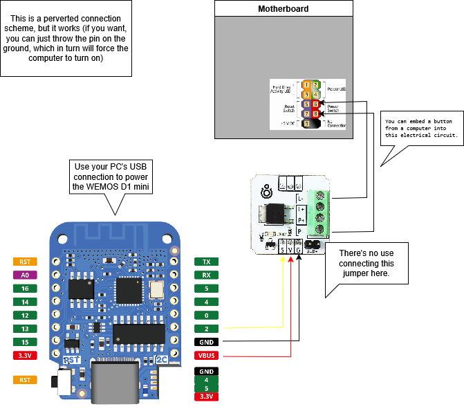

# ESP_PC_Controller

**Computer power management via ESP8266 (Wemos D1 mini) and a Telegram bot.**  
This project emulates pressing the Power button on the motherboard using an N-channel MOSFET (e.g., Troyka N-MOSFET from Amperka). It allows you to turn the PC on/off, perform a hard reset, and check its status (via ping) through Telegram commands.

 

---

## Features

- **Power on/off the computer** with a short MOSFET “press” on the Power SW pins.  
- **Hard reset** (5-second hold) for emergency shutdown/reset.  
- **Status check (Monitoring)** by pinging the machine’s IP address.  
- **Add new bot administrators** (stored in the `/admins.txt` file on LittleFS).  
- **Inline buttons**: a convenient menu right in the Telegram chat.  
- **Restart the ESP** itself with the `restart` command.

---

## Project Contents

- **`ESP_PC_Controller.ino`** (or another `.ino` name) — the main Arduino sketch.  
- **`/admins.txt`** (automatically created in LittleFS) — stores the list of admin Chat IDs.  
- **`LICENSE`** — the Apache 2.0 license text.

---

## Requirements

### Hardware

1. **Wemos D1 mini** (ESP8266) or equivalent (NodeMCU).  
2. **N-channel MOSFET module** (e.g., Troyka N-MOSFET from Amperka).  
3. **Wires**: 3–4 for connecting to the Wemos (power + signal), plus 2 wires to connect to the Power SW pins on the motherboard.  
4. **A computer** whose power button (F_PANEL pins) you want to control.

## Connection Diagram



### Arduino Libraries

1. **[FastBot2](https://github.com/GyverLibs/FastBot2)**
   - Used to create Telegram bots on ESP.  
   - Replaces the old FastBot library. Make sure the old library is removed or renamed.

2. **ESP8266WiFi** (included in the standard ESP8266 Core)  
3. **ESPping** (install via Arduino IDE “Library Manager”)  
4. **LittleFS** (also in the ESP8266 Core; ensure LittleFS is selected instead of SPIFFS)

Installation via Arduino IDE:
- **FastBot2**: Download the ZIP from its [repository](https://github.com/GyverLibs/FastBot2), then  
  `Sketch → Include Library → Add .ZIP Library...`  
  or use  
  `Tools → Manage Libraries...` → search for “FastBot2” → Install.  
- **ESPping**: `Tools → Manage Libraries...` → search for “ESPping” → Install.

---

## Project Setup

1. **Open the sketch** `ESP_PC_Controller.ino` (or whatever name you gave it).
2. At the top of the file, change `WIFI_SSID`, `WIFI_PASS`, `BOT_TOKEN`, `BOT_OWNER_ID`, `PC_IP` to your actual values. For example:
   ```cpp
   #define WIFI_SSID      "MyWiFi"
   #define WIFI_PASS      "MyPass"
   #define BOT_TOKEN      "12345678:abcdefg..."
   #define BOT_OWNER_ID   "123456789" // Your Telegram Chat ID
   #define PC_IP          "192.168.1.2" // PC IP for ping
   ```
3. Make sure MOSFET_PIN (e.g., 0 or 2) matches the Wemos pin to which the MOSFET module’s input is connected.(Optional) Set the bot polling mode:
   ```cpp
   // bot.setPollMode(fb::Poll::Sync, 4000);
   // or
   // bot.setPollMode(fb::Poll::Long, 30000);
   ```
4. In Tools → Flash Size, ensure enough space for LittleFS.

5. Upload the code to the Wemos.

---

## Usage

Power on the Wemos: once connected to Wi-Fi, the bot sends “Bot started!” to the main administrator (BOT_OWNER_ID).

   Add new admins:

      Find the person’s Chat ID (ask them to send /start to the bot, or use other methods).

      Send the bot: /make_admin 123456789

      The new admin can now perform all commands.

   Main commands:

      /help: help info

      “Включить ПК” / “Выключить ПК”: short 1-second press

      “Жёсткий сброс” (Hard reset): 5-second hold

      “Мониторинг” (Monitoring): ping the PC

      /menu: shows inline buttons

      restart: reboots the Wemos

   When new admins are added, their IDs go into /admins.txt (LittleFS). They persist after a reboot.

---

## Example Telegram Commands

 - /help — Sends a list of available commands.

 - /make_admin <id> — Adds a new admin, if you are already an admin.

 - “Включить ПК” — Emulates a 1-second press (turn on or soft-off).

 - “Жёсткий сброс” — 5-second MOSFET “hold,” like a forced shutdown.

 - “Мониторинг” — Pings PC_IP. If it replies, “PC is on,” otherwise “off.”

 - restart — Reboots the ESP.
 
 

---

## Possible Improvements

 - Protection against repeated presses (ignore if the button is already pressed).

 - Command restrictions (e.g., “Turn PC On” is disabled if it’s already on).

 - Web interface (ESP8266 WebServer).

 - Automatic notifications (if the PC stops responding to pings).
