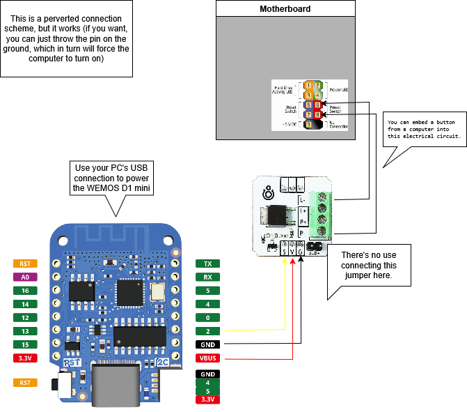
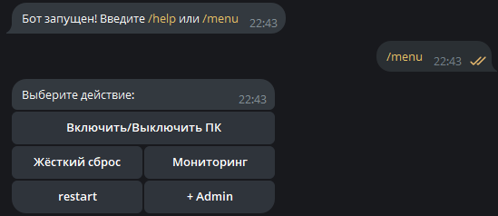

# ESP_PC_Controller

**Управление питанием компьютера через ESP8266 (Wemos D1 mini) и Telegram-бот.**  
Проект эмулирует нажатие кнопки Power на материнской плате, используя N-канальный MOSFET (например, Troyka MOSFET от Амперки). Позволяет включать/выключать/перезагружать ПК и проверять его статус (через пинг) по командам в Telegram.

---

## Возможности

- **Включение/выключение компьютера** путём короткого «нажатия» MOSFET на контакты Power SW.  
- **Жёсткий сброс** (5-секундное удержание) для аварийного выключения/рестарта.  
- **Проверка статуса (Мониторинг)** через пинг до IP-адреса машины.  
- **Добавление новых администраторов** бота (хранятся в файле `/admins.txt` на LittleFS).  
- **Inline-кнопки**: удобное меню прямо в чате.  
- **Перезагрузка самого ESP** по команде `restart`.  

## Содержимое проекта

- **`ESP_PC_Controller.ino`** — основной скетч для Arduino.  
- **`pc_switch_v2.3mf`** — STL-файл корпуса для 3D-печати моей версии.  
- **`LICENSE`** — текст лицензии Apache 2.0.  
- **`/docs/ESP_PC_Controller.png`** — схема подключения.  
- **`/docs/bot_menu.png`** — меню бота в Telegram (inline).  
- **`/docs/photos/without_case.png`** — плата контроллера без корпуса.  
- **`/docs/photos/with_case.png`** — плата контроллера в напечатанном корпусе.

---

## 🖼️ Галерея

  
*Плата собрана, без корпуса.*

  
*Все аккуратно спрятано внутри 3D-печатного корпуса.*

---

## Требования

### Аппаратное обеспечение

1. **Wemos D1 mini** (ESP8266) или аналог (NodeMCU).  
2. **Оптопара** (например, PC817) или любое другое переключающее устройство (MOSFET-модуль, реле и т.д.), обеспечивающее гальваническую развязку между ESP и контактами Power SW на материнской плате.  
   - Если используется MOSFET или реле без развязки, GND ESP и GND ПК должны быть соединены.  
   - При использовании оптопары (или другого развязывающего модуля) общий провод не требуется — достаточно подать сигнал на вход оптопары, и её внутренний транзистор переключит цепь Power SW.  
3. **Провода**: 3–4 для питания и сигнала к Wemos, плюс 2 для подключения к контактам Power SW на материнской плате.  
4. **ПК** с доступным разъёмом F_PANEL (контакты Power SW).


## Схема подключения



### Библиотеки Arduino

1. **[FastBot2](https://github.com/GyverLibs/FastBot2)**  
   - Позволяет создавать Telegram-боты на ESP.  
   - Заменяет старый FastBot. Убедитесь, что старая библиотека удалена/переименована.  
2. **ESP8266WiFi** (входит в стандартный ESP8266 Core).  
3. **ESPping** (можно установить через «Library Manager» Arduino IDE).  
4. **LittleFS** (также входит в ESP8266 Core, но нужно убедиться, что выбрано именно LittleFS, а не SPIFFS).  

Установка через Arduino IDE:
- **FastBot2**: скачайте ZIP из [репозитория](https://github.com/GyverLibs/FastBot2) → `Sketch → Include Library → Add .ZIP Library...`
или  `Tools → Manage Libraries...` → в поиске «FastBot2» → Install.
- **ESPping**: `Tools → Manage Libraries...` → в поиске «ESPping» → Install.

---

## Настройка проекта

1. **Откройте скетч** `ESP_PC_Controller.ino` (или как вы назвали).  
2. В начале файла поменяйте `WIFI_SSID`, `WIFI_PASS`, `BOT_TOKEN`, `BOT_OWNER_ID`, `PC_IP` на свои актуальные значения. Например:
   ```cpp
   #define WIFI_SSID      "MyWiFi"
   #define WIFI_PASS      "MyPass"
   #define BOT_TOKEN      "12345678:abcdefg..."
   #define BOT_OWNER_ID   "123456789" // Ваш Telegram Chat ID
   #define PC_IP          "192.168.1.2" // IP компа для пинга
   ```
   
   
3. Убедитесь, что MOSFET_PIN (например, 0 или 2) совпадает с пином Wemos, к которому фактически подключён вход MOSFET-модуля.
(Опционально) Установите режим опроса бота:
   ```cpp
   // bot.setPollMode(fb::Poll::Sync, 4000);
   // или
   // bot.setPollMode(fb::Poll::Long, 30000);
   ```
4. Проверьте, что в Tools → Flash Size выбрано достаточно места для файловой системы LittleFS.
Загрузите код на Wemos.

---

## Использование

Запустите Wemos: при подключении к Wi-Fi бот отправит «Бот запущен!» главному администратору (BOT_OWNER_ID).

   Добавление админов:

        Узнайте Chat ID нужного человека (пусть он напишет /start боту, смотрите Serial). Или используйте других ботов или API Telegram
        
        Отправьте боту: /make_admin 123456789
        
        Теперь новый админ может выполнять все команды.

   Основные команды:

        /help: справка,
        
        «Включить ПК» / «Выключить ПК»: короткое замыкание (1 сек),
        
        «Жёсткий сброс»: 5-секундное удержание,
        
        «Мониторинг»: пинг ПК,
        
        «/menu`: выводит inline-кнопки,
        
        restart: перезагрузка Wemos.

   При появлении новых админов, их ID добавляются в /admins.txt (LittleFS). После перезагрузки списка сохраняется.

---

## Пример команд в Telegram

   - /help - Отправляет список доступных команд.
   
   - /make_admin <id> - Добавляет нового администратора, если вы уже админ.
   
   - Включить ПК - 1 сек «нажатие» для включения (или мягкого выключения, если ПК включён).
   
   - Жёсткий сброс - 5 сек «зажатие» MOSFET, как удержание кнопки.
   
   - Мониторинг - Пингует PC_IP. Если отвечает — «ПК включён», иначе «выключен».
   
   - restart - Перезагружает саму ESP.
   
   

---

## Возможные улучшения

- Защита от повторных нажатий (если уже нажато, игнорировать).
- Ограничение команд: например, «Включить ПК» не активна, если уже включён.
- Web-интерфейс (ESP8266 WebServer).
- Автоматические уведомления (если ПК не пингуется).
